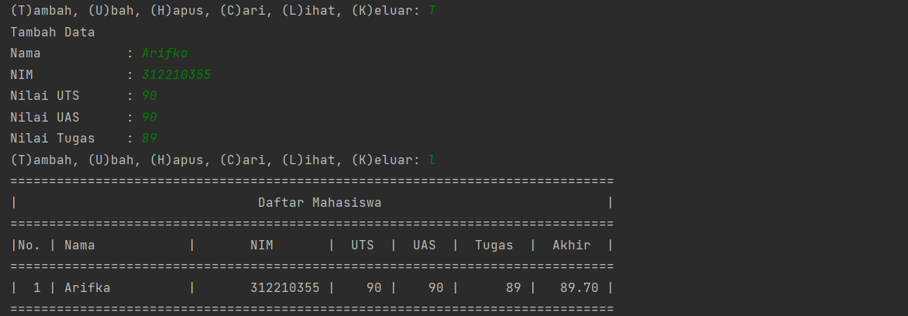

# PRAKTIKUM 5


## Program
dibawah ini adalah program sederhana untuk membuat daftar nilai mahasiswa dengan mnggunakan **Dictionary**, dan menampilkan pilihan **Menu** Tambah, Ubah, Hapus, Cari, dan Lihat.


## Flowchart
Dan berikut adalah tampilan dari flowchartnya :


## Penjelasan

- Mendeklarasikan Dictonary kosong dengan synatax
`data = {}`
- Lalu membuat perulangan while dan untuk menginisialkan penambahan menu pilihan Tambah, Ubah, Hapus, Cari, Lihat, dan Keluar :
```py
while True:
    x = input("(T)ambah, (U)bah, (H)apus, (C)ari, (L)ihat, (K)eluar: ")
```

## Menambahkan Data
- Berikut adalah Syntax untuk menambahkan data dengan ketentuan jika kita mengetikkan `T` pada keyboard, maka akan melakukan penambahan data dan ditampung kedalam Dictonary `data` yang telah kita buat, dengan nama sebagai `keys` dan yang lainnya sbagai values.
```py   
    if x.lower() == 't':
        print("Tambah Data")
        nama = input("Nama           : ")
        nim = int(input("NIM            : "))
        uts = int(input("Nilai UTS      : "))
        uas = int(input("Nilai UAS      : "))
        tugas = int(input("Nilai Tugas    : "))
        n_akhir = tugas * 0.30 + uts * 0.35 + uas * 0.35
        data[nama] = nim, uts, uas, tugas, n_akhir
```
## Mengubah Data
- Jika input yang dimasukkan adalah `U`, di dalam kondisi ini terdapat input dan kondisi, dimana jika input `nama` ada didalam variabel `data` maka akan muncul beberapa pilihan untuk mengubah semua data atau data tertentu saja.
    ```py    
    elif x.lower() == 'u':
        print("Ubah Data")
        nama = input("Masukkan Nama   : ")
        if nama in data.keys():
            nim = int(input("NIM            : "))
            uts = int(input("Nilai UTS      : "))
            uas = int(input("Nilai UAS      : "))
            tugas = int(input("Nilai Tugas    : "))
            n_akhir = tugas*0.30 + uts*0.35 + uas*0.35
            data[nama] = nim, uts, uas, tugas, n_akhir
        else:
            print("Nama{0} Tidak Ditemukan".format(nama))
## Menghapus Data 
- Sama seperti mengubah data yang dipilih.
- Data yang dihapus adalah data yang di input dalam variabel `nama` dimana berisi (string) yang mewakili **NIM, Nilai Tugas, UTS, UAS.** 
```py
    elif x.lower() == 'h':
        print("Hapus Data")
        nama = input("Masukkan Nama  : ")
        if nama in data.keys():
            del data[nama]
        else:
            print("Nama {0} Tidak Ditemukan".format(nama))
```
## Mencari Data
- Perbandingan untuk mencari data yang akan diubah sama seperti cara mengubah data, hanya saja perintah ini digunakan untuk menampilkan data yang di input berdasarkan nama. Berikut kode yang digunakan.
    ```py
    elif x.lower() == 'c':
        print("Cari Data")
        nama = input("Masukkan Nama : ")
        if nama in data.keys():
            print("=" * 73)
            print(
                "|                             Daftar Mahasiswa                          |")
            print("=" * 73)
            print(
                "| Nama            |       NIM       |  UTS  |  UAS  |  Tugas  |  Akhir  |")
            print("=" * 73)
            print("| {0:15s} | {1:15d} | {2:5d} | {3:5d} | {4:7d} | {5:7.2f} |"
                  .format(nama, nim, uts, uas, tugas, n_akhir))
            print("=" * 73)
        else:
            print("Nama {0} Tidak Ditemukan".format(nama))
## Melihat Data
- Selanjutnya adalah kode yang digunakan untuk melihat input yang sudah dimasukkan.
- Data dalam perulangan `for` di ambil dari variabel Dictionary `data` pada bagian value yang berbntuk list. variabel `i = 0` digunakan untuk membuat nomer. Data yang akan ditambilkan adalah **Nama, NIM, Nilai Tugas, UTS, UAS** dan **Nilai Akhir**
    ```py
    elif x.lower() == 'l':
        if data.items():
            print("=" * 78)
            print(
                "|                               Daftar Mahasiswa                             |")
            print("=" * 78)
            print(
                "|No. | Nama            |       NIM       |  UTS  |  UAS  |  Tugas  |  Akhir  |")
            print("=" * 78)
            i = 0
            for y in data.items():
                i += 1
                print("| {no:2d} | {0:15s} | {1:15d} | {2:5d} | {3:5d} | {4:7d} | {5:7.2f} |"
                      .format(y[0][:13], y[1][0], y[1][1], y[1][2], y[1][3], y[1][4], no=i))
                print("=" * 78)
        else:
            print("=" * 78)
            print(
                "|                               Daftar Mahasiswa                             |")
            print("=" * 78)
            print(
                "|No. | Nama            |       NIM       |  UTS  |  UAS  |  Tugas  |  Akhir  |")
            print("=" * 78)
            print(
                "|                                TIDAK ADA DATA                              |")
            print("=" * 78)
## Keluar 
Perulangan diatas adalah perulangan yang akan berjalan terus menerus dan akan berhenti jika kode berikut di eksekusi
`    elif x.lower() == 'k':`
- Jika `k` di input dan `lower()` digunakan untuk mengkonversi input yang dimasukkan ke bentuk lower case dan input `k` digunakan berdasarkan perintah yang sudah dimasukan dalam keterangan pada fungsi input dibawah ini:
```py
    elif x.lower() == 'k':
        break
    else:
        print("Pilih Menu Yang Tersedia")
```
## Hasil Output
- Apabila program dijalankan maka akan menghasilkan output sebagai berikut :
 - Menambahkan Data dengan input `T` dan melihat data dengan input `L`
 
 - Mengubah Data dengan input `U` dan melihat data dengan input `L`
 
 - Mencari Data dengan input `C`
 
 - Menghapus Data dengan input `H` dan melihat data dengan input `L`
 
 - Keluar dari program dengan input `K`
 
 
# **Terima Kasih** 
